# Pasos para crear App Business API Meta

## Portafolio comercial

Para proder crear una App en Meta, se requiere de un portafolio comercial. Y para la creación del portafolio comercial se requiere de una cuenta personal de Facebook. Si no se dispone de un portafolio comercial siga los siguientes pasos

1. Ingresar a la página comercial: [Meta Business Suite](https://business.facebook.com)
2. Crear el portafolio comercial: 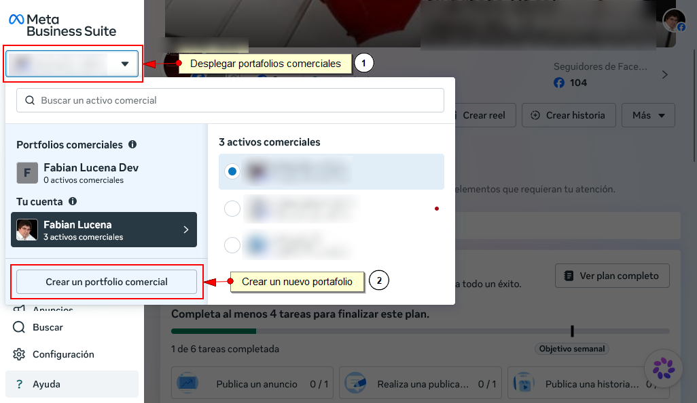

## Creación de la App Business API Meta

1. Ingresar a: [Facebook](https://www.facebook.com/) con la cuenta de la persona que administra la empresa
2. Ingresar a: [Facebook Developers](https://developers.facebook.com/apps)
3. Crear una App, usar el botón verde "Crear App":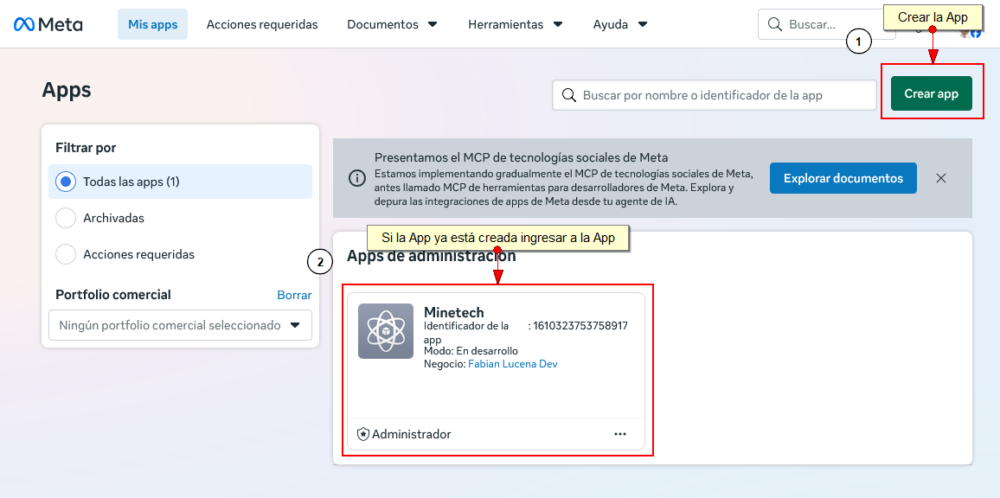
4. Colocar el nombre de la App y el emial del responsable: 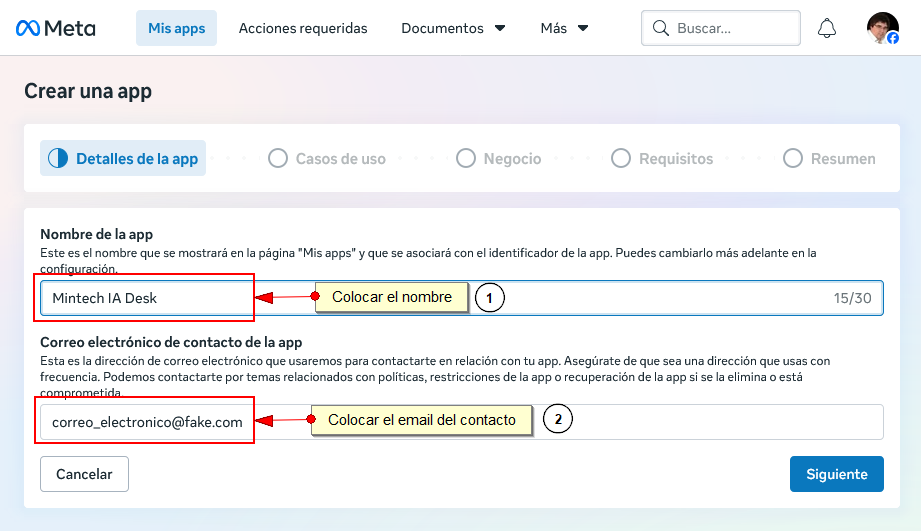
5. Agregar el caso de uso para WhastApp: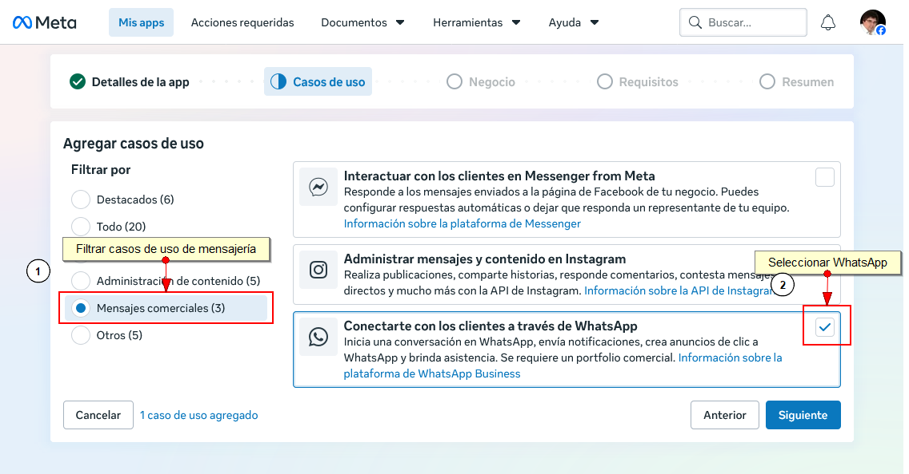
6. Conectar al portafolio comercial: 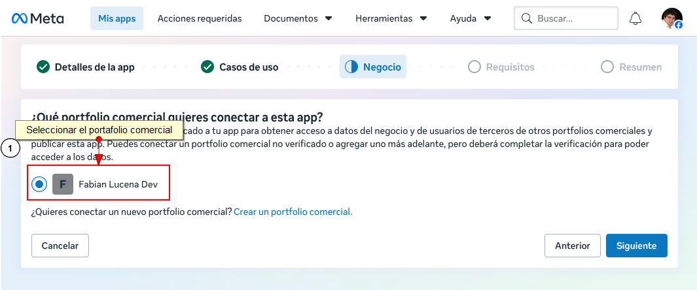
7. Normalmente no se requieren requisitos adicionales: 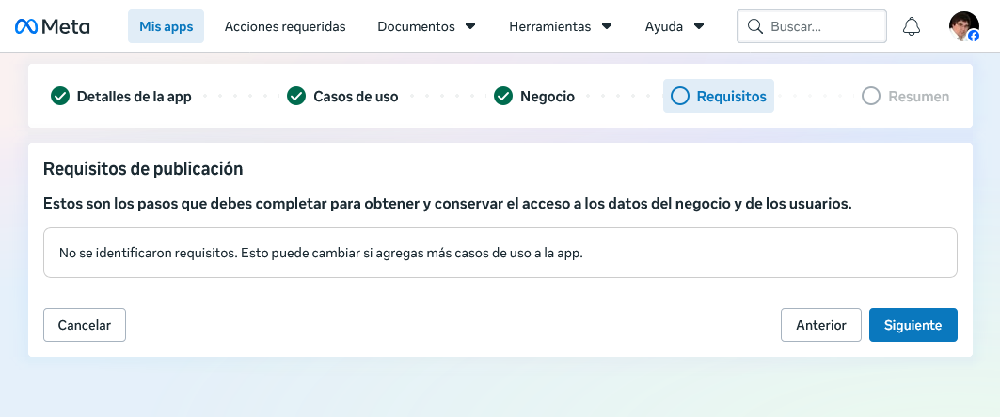
8. Y, finalmente, creamos la App: 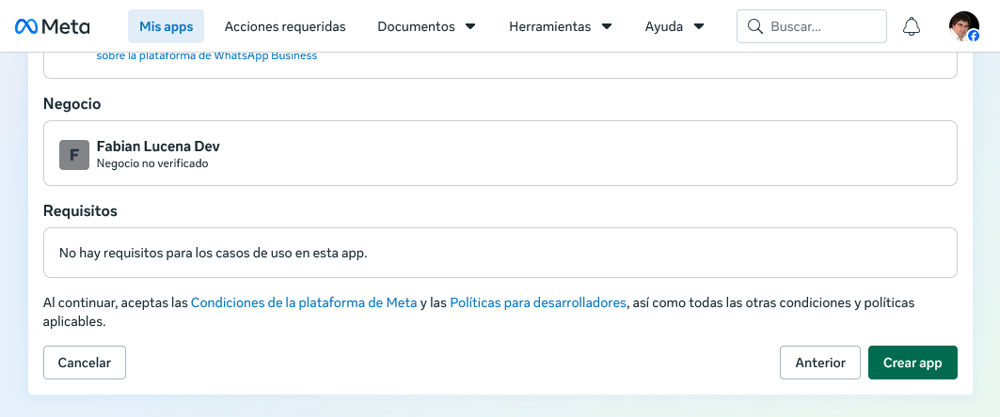

## Creación de la App de prueba

La App de prueba permite realizar pruebas, cambios y corregir errores sin afectar el comprtamiento de la app.

1. Desde el menú de la App se crea la App de prueba: 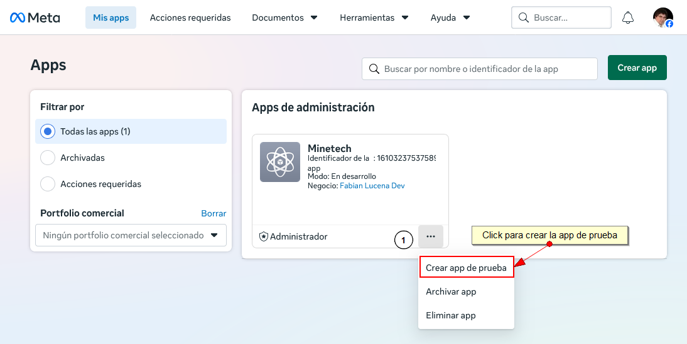
2. Colocar el nombre de App de prueba: 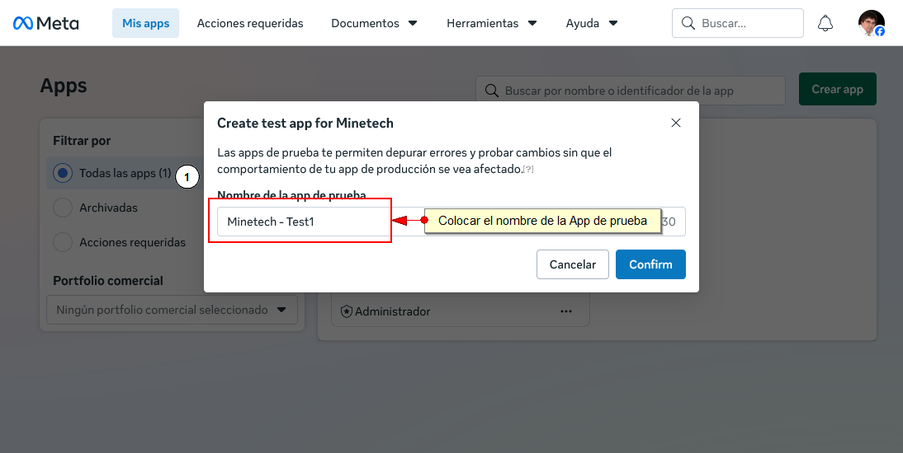

## Obtención del número y la API key

1. En el panel de administración de la App principal (no la App de prueba) accedemos a personalizar casos de uso: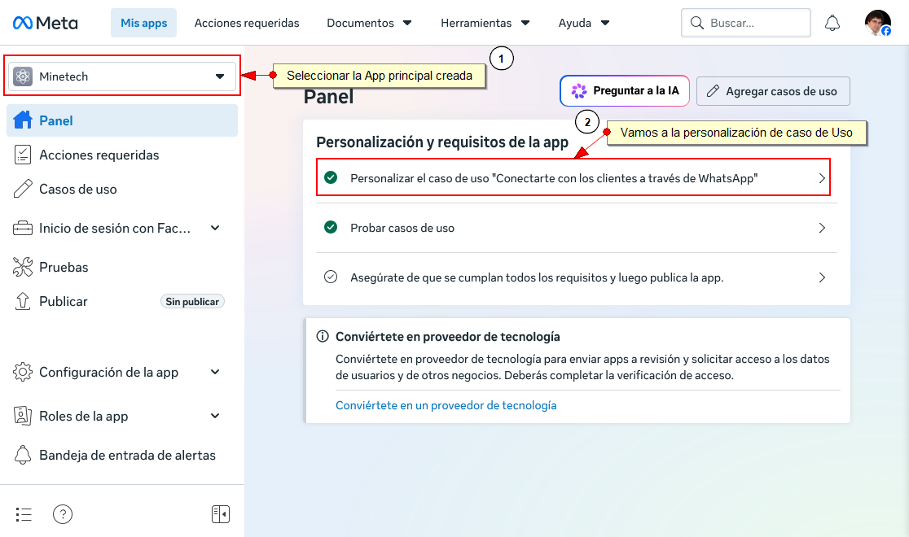
2. Acceder al **Paso 1. Pruébalo** y copiar los datos: Phone Number ID y Token de acceso para colocarlos en la configuración de la Aplicación: 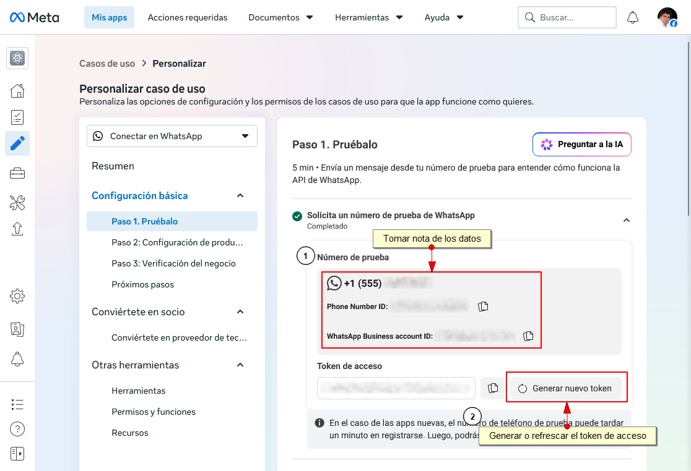
3. Configurar los números destinatarios y enviar mensajes de prueba. Mientras las App esté en modo prueba se pueden enviar mensajes unicamente a estos destinatarios: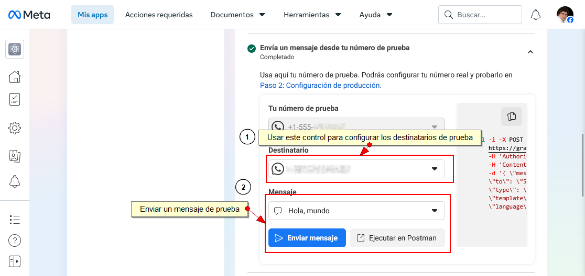
